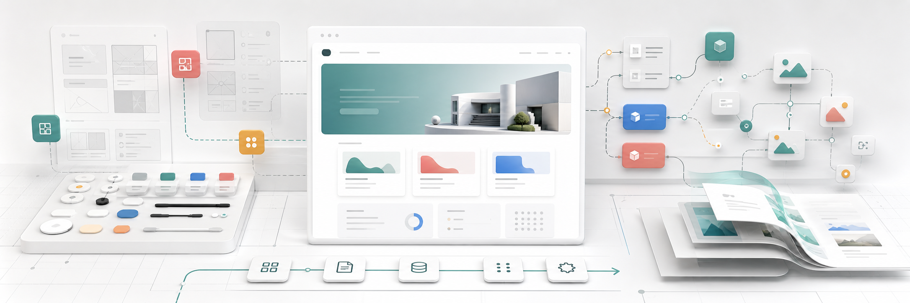

# Webvizion Template

An agent-ready Next.js website template for starting with a lightweight page
scaffold, then growing only the design-system and content pieces a project
actually needs.

The main path is intentionally small: a marketing shell, a typed section
renderer, fallback content, shared primitives, motion foundations, and optional
CMS scaffolding. Agents can implement a project-specific design system without
first dismantling a large demo application, while still having richer template
infrastructure available when a build needs it.

## Quick Start

```bash
npm install
npm run dev
```

Open the printed local URL. The default human development command uses the
user dev-server path. Agents that need browser automation should use the
isolated server instead:

```bash
npm run dev:agent
```

Run the main checks with:

```bash
npm run verify:static
npm run build
```

## The Main Path

Use this template when you want agents to start from useful structure instead of
a blank app:

1. Keep the marketing route shell under `src/app/(site)/(marketing)`.
2. Add or replace sections through `src/lib/marketing-content/types.ts`,
   `src/lib/marketing-content/sections/registry.tsx`, and the fallback content
   in `src/lib/marketing-content/fallback.ts`.
3. Build the project design system in `src/components/ui` and
   `src/components/branding`.
4. Keep page data lightweight: pages, sections, navigation, CTA, footer, and
   social links.
5. Resolve source-specific details in server-side adapters before they reach
   React section components.

That keeps the frontend contract simple enough for static sites, while leaving
a clean upgrade path to Payload when a project needs CMS editing.

## What Ships Here

- **Next.js App Router foundation:** route groups for the public site, guarded
  Payload stubs, API routes, metadata, sitemap generation, and error states.
- **Marketing shell:** header, compact/full navigation, menu/search data,
  footer, scroll controller, and route-level reveal motion.
- **Typed section renderer:** a small `MarketingSection` contract, renderer
  registry, fallback page data, and a starter home hero block.
- **Design-system starting point:** primitives, inputs, overlays, motion
  helpers, focus/motion foundations, branding, and mount components.
- **Content modes:** static fallback content, Payload-ready scaffold, or
  Payload-powered Vercel setup.
- **Template Intelligence:** generated repo maps and topic queries that help
  agents find the right files before broad searching.
- **Agent-safe dev server wrapper:** `npm run dev:agent` isolates ports and
  generated Next.js build directories from the user's dev server.
- **Template pruning:** scripts for removing optional surfaces and Payload when
  a cloned project should be lighter.
- **Thin-start activation:** an explicit instance-only path that parks the
  broader reference system and rewrites the live primitive surface to a minimal
  allowlist.

## Directory Map

| Path | Purpose |
| --- | --- |
| `src/app/(site)/(marketing)` | Public website route shell, home page, fallback route, layout, internal intelligence surface, and shared marketing layout components. |
| `src/lib/marketing-content` | Lightweight page, section, navigation, and layout data contracts plus fallback resolvers. |
| `src/lib/marketing-content/sections` | Section renderer registry and section implementations. |
| `src/components/ui` | Shared UI primitives, inputs, overlays, motion helpers, and foundations. |
| `src/components/branding` | Brand-level presentation primitives such as the logo. |
| `src/components/mount` | Client-only mounts for toasts, modals, validation, loading, and scroll behavior. |
| `src/payload` | Payload collections, globals, blocks, and activation helpers. |
| `scripts` | Template intelligence, dev server, prune, thin-start, smoke, and maintenance tooling. |
| `docs` | Content-mode, Payload, responsive rendering, thin-start, and template-intelligence notes. |
| `public` | Static public assets, including the README banner. |

## Content Modes

The frontend should render a small page/section contract regardless of where
content comes from.

- **Static:** remove Payload with `npm run prune:template -- --no-payload` and
  build from TypeScript fallback content.
- **Payload-ready:** keep guarded Payload files in the repo, but do not expose
  live admin/API routes until the project commits to CMS editing.
- **Payload-powered Vercel:** enable real Payload admin/API routes, provision
  Neon Postgres and Vercel Blob, and adapt Payload documents into the same
  lightweight render props.

Read `docs/template-content-modes.md` for the mode boundaries and
`docs/payload-vercel-neon-blob.md` before activating Payload on Vercel.

## Creating a Lightweight Instance

For most new projects, clone or use this template and prune only the optional
route families that are not needed. Always dry-run first:

```bash
npm run prune:template -- --dry-run --no-dashboard --no-demo --no-dictionary --no-reference --no-playground
```

Then apply the lightweight route-surface prune:

```bash
npm run prune:template -- --yes --no-dashboard --no-demo --no-dictionary --no-reference --no-playground
```

For a static site, remove Payload explicitly:

```bash
npm run prune:template -- --yes --no-dashboard --no-demo --no-dictionary --no-reference --no-playground --no-payload
```

The prune script owns route, navigation, search, package, and smoke-test
rewrites so the clone stays buildable after surfaces are removed.

## Thin-Start Mode

Thin-start is not the default template state. It is an explicit instance
activation path for projects that should begin with the smallest accepted live
primitive surface while keeping the original Webvizion system parked as
reference-only code.

Preview the mutation:

```bash
npm run create:thin-start -- --dry-run --in-place
```

Apply it only inside a target project instance:

```bash
npm run create:thin-start -- --yes --in-place --confirm-instance
npm install
npm run review:thin-start-api -- --strict
npm run build
```

Read `docs/thin-start-creation-boundary.md` before using this path.

## Template Intelligence

The template includes local map generation for agents:

```bash
npm run intelligence:generate
npm run intelligence:query -- route-architecture
npm run intelligence:query -- ui-primitives
npm run intelligence:query -- content-modes
```

The generated `.template-intelligence/` and `.serena/` folders are local
artifacts and are intentionally ignored. See `docs/template-intelligence.md`
for the full workflow.

## Useful Scripts

| Script | Purpose |
| --- | --- |
| `npm run dev` | Human local development server. |
| `npm run dev:agent` | Isolated development server for agent browser testing. |
| `npm run build` | Production Next.js build. |
| `npm run lint` | Biome checks. |
| `npm run typecheck` | TypeScript check without emit. |
| `npm run verify:static` | Lint plus typecheck. |
| `npm run verify:smoke` | Route smoke verification. |
| `npm run verify` | Static checks, build, and smoke verification. |
| `npm run prune:template` | Remove optional template surfaces in a clone. |
| `npm run create:thin-start` | Activate the optional thin-start instance path. |
| `npm run review:thin-start-api` | Review exported API surface after thin-start activation. |

## Deployment Notes

The template is designed for Vercel. Static and Payload-ready projects can ship
without live Payload routes. Payload-powered projects should use Neon Postgres
for `DATABASE_URL`, Vercel Blob for `BLOB_READ_WRITE_TOKEN`, and a
project-specific `PAYLOAD_SECRET`.

Keep secrets in ignored local or platform environment stores. Do not commit
tokens, deploy hooks, database URLs, or Payload secrets.
